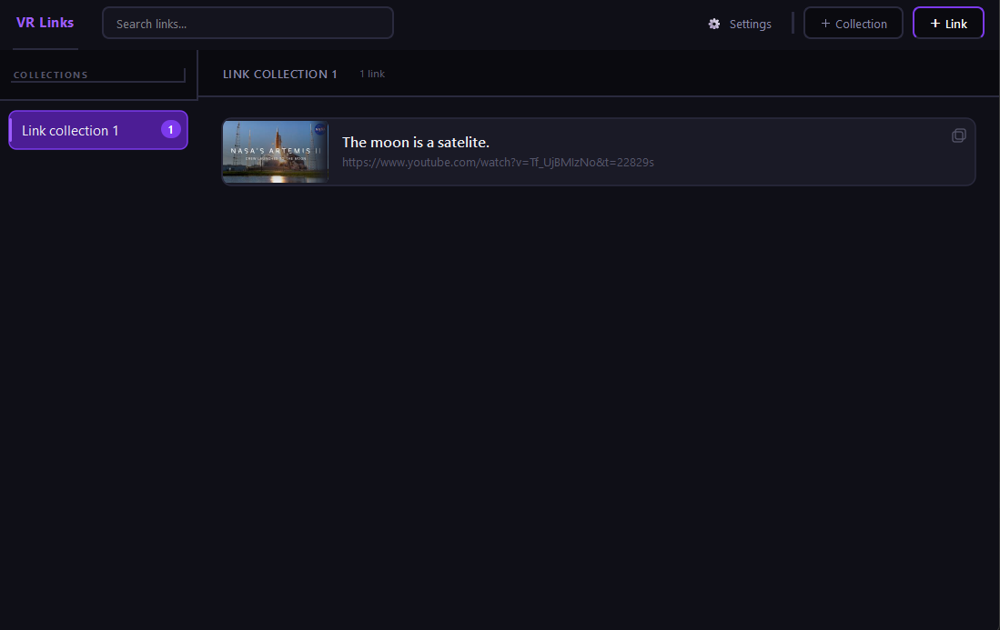

# VRLinks

A program designed to store website links for VRChat, allowing you to quickly copy them in VR.


---

## Features
* **Collections** — Organize links into logical groups.
* **Link Cards** — Click any card to instantly copy the URL to clipboard.
* **YouTube Thumbnails** — Automatically fetched for YouTube links.
* **Search** — Real-time filtering within the active collection.
* **Dark purple theme** — Clean, modern, and easy-to-use UI.

---

## Interface Overview
The main interface provides quick access to your collections and links.



---

## Installation

### Prerequisites
* **Python 3.11** or higher is required.

### Steps
1. **Install dependencies:**
   ```bash
   pip install -r requirements.txt
   ```

2. **Launch the application:**
   ```bash
   python main.py
   ```

---

## Data & Configuration
All your collections and links are stored locally in:
`%APPDATA%/VRLinks/data.json`

Make sure to back up this file to save your data or share it with others.

---

## Contact
For feature requests or questions, contact me on Discord: `aapfel`
